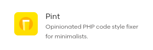
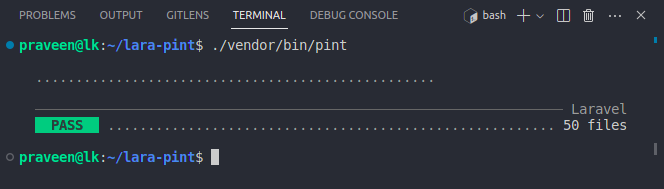
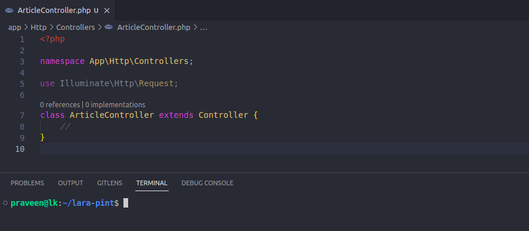
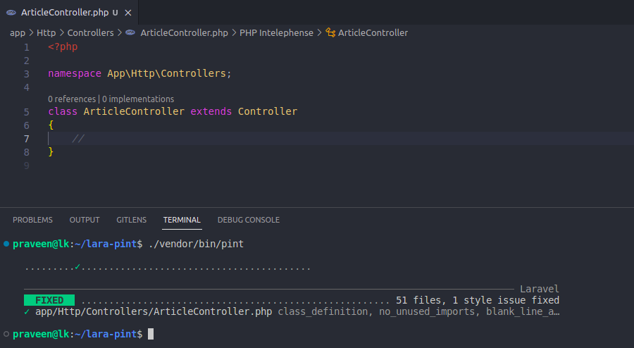

# Pint

## PHP + Lint = Pint (Same as PHP + Test =  Pest)

The opinionated PHP code style fixer for minimalists.

https://laravel.com/docs/10.x/pint

## ./vendor/bin/pint

# PHP CS Fixer

https://github.com/PHP-CS-Fixer/PHP-CS-Fixer

## Before

## After

